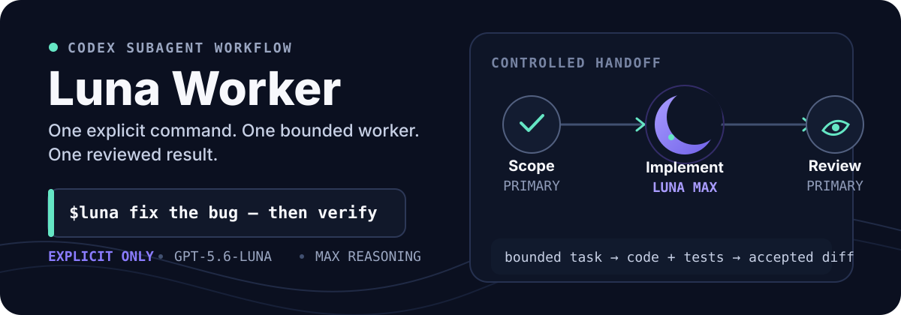

<p align="center">
  
</p>

<p align="center">
  用 <code>$luna</code> 显式委托清晰、可验证的编码任务；让主代理继续掌握范围、判断和最终验收。
</p>

<p align="center">
  <a href="#quick-start">快速开始</a> ·
  <a href="#how-it-works">工作方式</a> ·
  <a href="#configuration">配置</a> ·
  <a href="#troubleshooting">排障</a>
</p>

## Why Luna Worker

Codex Luna Worker 把“执行”从主会话中拆出来，同时保留可控边界：

- **显式触发**：只有输入 `$luna` 才会委托，不会接管普通编码请求。
- **单一执行者**：一次只启动一个 `luna-worker`，避免多个写代理争抢同一批文件。
- **主代理验收**：Luna 完成实现和最小相关测试后，主代理检查真实 diff，再决定是否接受。
- **共享工作区友好**：子代理必须保留已有改动，遇到无法确认的文件所有权时停止并报告。

适合小功能、已定位的 bug、有限重构和明确文件范围的机械性修改。模糊需求、架构设计、破坏性操作与最终验收仍由主代理负责。

## Quick start

### 1. 安装

```bash
git clone https://github.com/dff652/codex-luna-worker.git && cd codex-luna-worker && ./install.sh
```

安装器会写入：

```text
${CODEX_HOME:-$HOME/.codex}/agents/luna-worker.toml
$HOME/.agents/skills/luna/SKILL.md
```

它不访问网络，也不会静默覆盖内容不同的已有配置。安装后重启 Codex、重新加载 IDE Extension，或开启新会话。

### 2. 委托一个任务

```text
$luna 修复用户列表翻页后筛选条件丢失的问题。
只修改用户管理页面及其测试；不要调整 API 协议。
验收：切换页码后筛选条件仍保留，相关前端测试通过。
```

好的 `$luna` 请求通常包含三样东西：**任务边界、允许修改的范围、验收标准**。

## How it works

```text
用户请求
   ↓
主代理：明确范围与验收条件
   ↓
luna-worker：检查代码 → 实现 → 最小相关验证
   ↓
主代理：检查真实 diff → 补充验证 → 最终交付
```

仓库中三个文件分别守住不同职责：

| 文件 | 作用 |
| --- | --- |
| `agents/luna-worker.toml` | 固定模型、推理强度与编码执行边界 |
| `skills/luna/SKILL.md` | 定义委托、等待、复核和汇报流程 |
| `skills/luna/agents/openai.yaml` | 暴露 `$luna`，并关闭隐式触发 |

## Configuration

默认使用 Luna Max：

```toml
model = "gpt-5.6-luna"
model_reasoning_effort = "max"
```

`Luna` 是模型，`max` 是推理强度。Max 会给单个任务更多推理与检查时间，也通常带来更高延迟和 token 消耗。若更看重速度，可把已安装 agent 文件改为：

```toml
model_reasoning_effort = "high"
```

提高推理强度不会改变任务边界：开放式、跨模块或高风险工作仍应留给 Sol 或主代理。

### 自定义安装目录

```bash
./install.sh --codex-home /absolute/path/to/codex-home --skills-dir /absolute/path/to/skills
```

也可通过 `CODEX_SKILLS_DIR` 指定 skill 根目录。Windows 用户可按项目结构手动复制对应文件。

## Safety boundaries

- 不同时运行多个会修改重叠文件的子代理。
- 不让 Luna 执行无监督的删除、发布或生产部署。
- 不依赖子代理摘要代替真实 diff 和测试结果。
- 不在分享配置中加入 API key、MCP 凭据、内部路径或项目私有规则。
- 安装器遇到内容不同的目标文件会 fail-loud，交由用户人工比较。

## Troubleshooting

<details>
<summary><strong><code>$luna</code> 没有出现</strong></summary>

1. 确认安装命令与启动 Codex 的用户相同。
2. 检查是否设置了非默认 `CODEX_HOME` 或 `CODEX_SKILLS_DIR`。
3. 重启 Codex或重新加载 IDE Extension。
4. 开启新会话后再次输入 `$luna`。
5. 确认工作区允许 subagent，且账号可用 `gpt-5.6-luna`。

</details>

<details>
<summary><strong>提示 <code>luna-worker</code> 不可用</strong></summary>

检查 agent 文件位置和 TOML 格式：

```bash
test -f "${CODEX_HOME:-$HOME/.codex}/agents/luna-worker.toml" && codex --strict-config doctor --summary
```

skill 会显式报告角色不可用，不会悄悄换用另一个自定义 agent。

</details>

<details>
<summary><strong>为什么不是 <code>/luna</code></strong></summary>

Codex 当前推荐用 `$luna` 显式调用 skill。旧式自定义 Prompt 可以形成 `/prompts:luna`，但该机制已经弃用；当前没有公开支持的方式注册独立顶级 `/luna` 命令。

</details>

## Compatibility

- 已在 `codex-cli 0.145.0` 验证配置加载与安装流程。
- 需要当前账号或工作区能够使用 `gpt-5.6-luna`。
- Codex 的自定义 agent 格式仍可能演进；升级后若加载失败，请先检查当前官方文档。

## References

- [Codex Subagents](https://learn.chatgpt.com/docs/agent-configuration/subagents)
- [Build Skills](https://learn.chatgpt.com/docs/build-skills)
- [Custom Prompts（已弃用）](https://learn.chatgpt.com/docs/custom-prompts)

## License

[MIT](./LICENSE) © 2026 dff652
